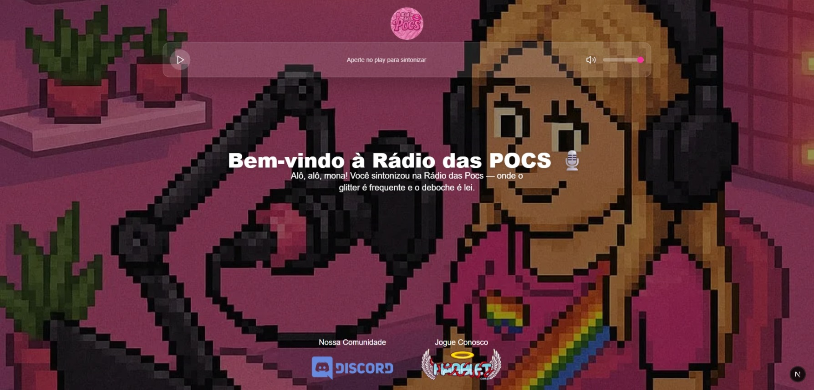

# 🎙️ Rádio das POCs

Projeto simples e divertido de rádio online feito para uma amiga que queria locutar para os amigos. A rádio toca via streaming e tem suporte para locução ao vivo. Desenvolvido com Next.js + TypeScript e focado em uma interface estilosa e intuitiva.

## 💡 Sobre o projeto

A Rádio das POCs é uma página que reproduz um streaming de rádio online e permite:

- Tocar e pausar o áudio manualmente.
- Controlar o volume.
- Ver uma interface temática divertida com logo animado.
- Compatível com serviços como **SAM Broadcaster**, **Shoutcast** ou **Icecast**.

## 🚀 Tecnologias utilizadas

- [Next.js 13+](https://nextjs.org/)
- [TypeScript](https://www.typescriptlang.org/)
- [Tailwind CSS](https://tailwindcss.com/)
- [Lucide React Icons](https://lucide.dev/)
- Streaming via URL pública configurada via variável de ambiente.

## 🛠️ Como usar

1. Clone o repositório:
   ```bash
   git clone https://github.com/seuusuario/radio-das-poc.git
   ```

2. Instale as dependências:
   ```bash
   npm install
   ```

3. Crie um arquivo `.env.local` com a URL do seu streaming:
   ```env
   STREAM_URL=https://listen.radioking.com/radio/734252/stream/800552
   ```

4. Rode o projeto:
   ```bash
   npm run dev
   ```

5. Acesse no navegador:
   ```
   http://localhost:3000
   ```

## 🎧 Streaming

A URL do stream é configurada via variável de ambiente:

```env
STREAM_URL=https://listen.radioking.com/radio/734252/stream/800552
```

E usada no código da seguinte forma:

```tsx
<audio ref={audioRef} loop>
  <source src={process.env.STREAM_URL} type="audio/mpeg" />
</audio>
```

Você pode substituir a URL por outra compatível com seu servidor de rádio (Shoutcast, Icecast, etc).

## ✨ Preview



## 🤝 Créditos

Criado com carinho para uma amiga locutar pros amigos 💜  
Desenvolvido por [Lucas Batista de Almeida Moro](https://github.com/dev-LBAM)
